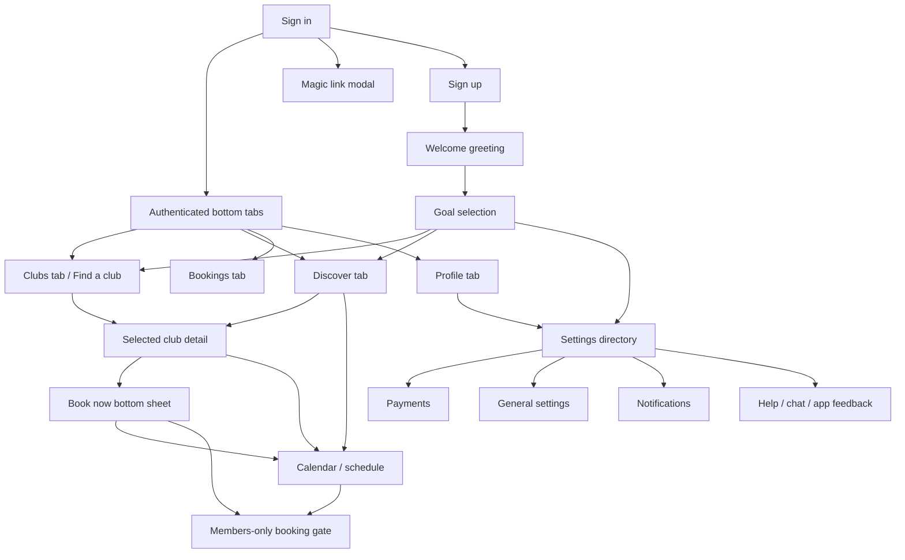

# Playbypoint App Flows

Source: screenshots in `playbypoint/`. This is an inferred flow map only.

## Primary Navigation Model

The authenticated app appears to use a four-tab bottom navigation:

```text
Clubs -> club search, favorite clubs, selected club detail
Bookings -> scheduled/unscheduled bookings and booking filters
Discover -> discovery dashboard, filters, map, recommended clubs/courts
Profile -> profile overview, profile edit, settings directory
```

Most feature pages are pushed above one of these tabs with a back button.

## High-Level Flow Map



## Launch / Auth / Onboarding

### Screens

- `playbypoint/welcome.jpg`
- `playbypoint/Welcome first step.jpg`
- `playbypoint/Signin.jpg`
- `playbypoint/Sign In Magic Link.jpg`
- `playbypoint/Signup.jpg`

### Flow

1. User opens app.
2. If not authenticated, user can sign in or sign up.
3. Sign in supports email/password and magic-link email.
4. After authentication, user reaches a welcome screen.
5. Welcome CTA leads to goal selection.
6. Goal selection likely routes to:
   - `Join a specific club or facility` -> Clubs / Find a club
   - `Discover a club near me` -> Discover / location search
   - `Find matches and play with others` -> Game Matches
   - `Something else` -> default main tab or settings, needs verification

### Data/Services

- Authentication/session service
- Magic-link email delivery
- User registration
- User onboarding preference persistence
- Legal links for Terms of Service and Privacy Policy

## Club Discovery Flow

### Screens

- `playbypoint/Find a club.jpg`
- `playbypoint/Enable Location.jpg`
- `playbypoint/Favorite Club.jpg`
- `playbypoint/Discover Page.jpg`
- `playbypoint/Discover Filter.jpg`
- `playbypoint/Settings Discover Filter.jpg`
- `playbypoint/Discover Map.jpg`

### Flow

```text
Clubs tab
  -> Find a club
  -> Search or choose Suggested Clubs
  -> Selected club detail

Find a club
  -> Explore clubs near you
  -> If GPS disabled: GPS dialog
  -> If GPS enabled: map/search results

Discover tab
  -> Search field -> Find a club/search results
  -> Filter icon -> Discover filter bottom sheet -> Apply -> filtered results
  -> Map icon -> Discover map -> selected club card -> club detail
  -> Clubs for You / Book a Court cards -> club detail or booking/calendar

Favorite clubs empty state
  -> Discover more Clubs -> Find a club/discover list
```

### Data/Services

- Location permission and GPS enabled state
- Club search and suggested clubs
- Club logos, addresses, coordinates, distance
- Map provider integration
- Availability search by date/time/sport
- Favorite club list/status

## Club Detail / Booking Flow

### Screens

- `playbypoint/Selected Club About.jpg`
- `playbypoint/Selected Club Book.jpg`
- `playbypoint/Book Now Button.jpg`
- `playbypoint/View Calendar.jpg`
- `playbypoint/View Calendar Schedule.jpg`
- `playbypoint/Settings Membership required if not member.jpg`

### Flow

```text
Selected club detail
  -> About tab
     -> Save/favorite
     -> Chat
     -> Read More
     -> Address/phone/map
     -> Book now
  -> Book tab
     -> View Calendar
     -> Book now

Book now
  -> Booking type bottom sheet
  -> Select "Book Now"
  -> Next
  -> Calendar/schedule or member-only gate

Calendar/schedule
  -> Change date
  -> Scroll courts/times
  -> Tap reservation block
  -> Reservation detail modal
```

### Data/Services

- Facility profile, media, copy, logo, contact details
- Membership restriction/status per facility
- Court inventory and playability status
- Calendar reservations by court and time
- Booking type options
- Chat thread for facility support/reservation questions

### Verification Gaps

- Final reservation creation is not shown.
- Payment/checkout from booking is not shown.
- Member verification result flow is not shown.
- Calendar screenshot shows existing reservations, not open slot selection.

## Bookings Management Flow

### Screens

- `playbypoint/My Booking Scheduled.jpg`
- `playbypoint/My Booking Unscheduled.jpg`
- `playbypoint/My Booking Categories Filter.jpg`
- `playbypoint/My Booking Payment Filter.jpg`

### Flow

```text
Bookings tab
  -> Scheduled tab
  -> Unscheduled tab
  -> Date filter
  -> Payment status filter
     -> All / Paid / Unpaid
  -> Categories filter
     -> All / Reservation / Lesson / Rental / Program
```

### Data/Services

- User bookings
- Scheduled/unscheduled status
- Booking category
- Payment status
- Filter query state

### Verification Gaps

- Date filter sheet is not captured.
- Booking detail page is not captured.
- Empty state only is captured.

## Profile And Settings Flow

### Screens

- `playbypoint/Profile.jpg`
- `playbypoint/Profile Update.jpg`
- `playbypoint/Settings.jpg`
- `playbypoint/Settings2.jpg`

### Flow

```text
Profile tab
  -> Edit avatar/profile
  -> Settings gear
     -> Settings directory
        -> Game Matches
        -> My Recordings
        -> Leaderboard
        -> My Orders
        -> Memberships
        -> Payments
        -> Proof Of Residency
        -> Family
        -> Waivers
        -> Friends
        -> Notifications
        -> General
        -> Help Center
        -> App Feedback
        -> About
        -> Sign out
        -> Delete Account
```

### Data/Services

- User profile and avatar
- Profile visibility settings
- Booking/follower/following counts
- App version
- Account deletion and sign-out workflows

## General Settings Flow

### Screens

- `playbypoint/Settings General.jpg`
- `playbypoint/Settings General Language.jpg`
- `playbypoint/Settings General Statistics.jpg`
- `playbypoint/Settings General Change Password.jpg`

### Flow

```text
Settings -> General
  -> Language
     -> Select language
     -> Accept
  -> Statistics
     -> View monthly reservation counters
  -> Change Password
     -> Enter password
     -> Confirm password
     -> Update
```

### Data/Services

- Locale preference
- Monthly booking statistics
- Password update service

### Verification Gaps

- Language option `Spahish` appears misspelled.
- Error/success states for password update are not captured.

## Notifications Flow

### Screens

- `playbypoint/Settings Notifications.jpg`
- `playbypoint/Settings Notifications2.jpg`

### Flow

```text
Settings -> Notifications
  -> Toggle Push Notifications
  -> Toggle individual push categories
  -> Toggle Email Notifications
  -> Toggle individual email categories
  -> Update
```

### Data/Services

- Push token/device registration
- Notification preference store
- Email notification opt-in
- Category taxonomy for reservation, clinic, lesson, gamematch, residency, and announcement events

## Payments Flow

### Screens

- `playbypoint/Settings Payment.jpg`
- `playbypoint/Settings Payment Cards Add New Cards.jpg`
- `playbypoint/Add New Cards Form.jpg`
- `playbypoint/Settings Payment Billng Address.jpg`
- `playbypoint/Settings Payment Billing Address Add Form.jpg`
- `playbypoint/Settings Payment Club Credits.jpg`
- `playbypoint/Settings Payment Club Account.jpg`
- `playbypoint/Settings Payment Payment History.jpg`
- `playbypoint/Settings Payment Booking Passes.jpg`

### Flow

```text
Settings -> Payments
  -> Cards
     -> Empty cards state
     -> Add New Card
     -> Save card
  -> Billing address
     -> Empty billing list
     -> Add billing address
     -> Save address
  -> Club Credits
     -> Select facility
     -> View current balance
  -> Club Account
     -> Select/view facility account
  -> Payment History
     -> View transactions
  -> Booking passes
     -> View pass inventory/status
```

### Data/Services

- Payment provider/tokenized cards
- Billing addresses
- Facility-specific credit balances and accounts
- Payment transaction history
- Booking pass inventory
- Currency formatting

### Verification Gaps

- Card tokenization/3DS/payment processor screens are not captured.
- No actual card or billing record is shown.
- No payment history item/detail is shown.

## Membership / Verification Flow

### Screens

- `playbypoint/Settings Membership.jpg`
- `playbypoint/Settings Membership required if not member.jpg`
- `playbypoint/Settings Proof Of Residency.jpg`

### Flow

```text
Settings -> Memberships
  -> Empty membership list

Club booking attempt
  -> Member-only gate
  -> Explore Memberships
  -> Memberships or membership catalog
  -> Request member verification
  -> Proof Of Residency / verification workflow
```

### Data/Services

- Membership list/status
- Facility-specific member restrictions
- Verification request status
- Proof of residency upload/review

### Verification Gaps

- Membership catalog or purchase screen is not captured.
- Verification request confirmation/status screen is not captured.

## Chat / Support Flow

### Screens

- `playbypoint/Chats Support.jpg`
- `playbypoint/Chats Reservation.jpg`
- `playbypoint/Chat Archieved.jpg`
- `playbypoint/Settings Help Center.jpg`
- `playbypoint/Settings App Feedback.jpg`

### Flow

```text
Club detail -> Chat
  -> Chats
     -> Support tab
     -> Reservation tab
     -> Archived chats

Settings -> Help Center
  -> Chat with us
  -> Call us
  -> Technical Support

Settings -> App Feedback
  -> Support widget
     -> Messages
     -> Help
     -> Send us a message
     -> Search articles
     -> System Status
```

### Data/Services

- Chat provider
- Conversation list and archived threads
- Reservation-specific chat grouping
- Help article catalog
- System status URL
- Support phone/contact settings

## Social / Game Flow

### Screens

- `playbypoint/Settings Game Matches.jpg`
- `playbypoint/Settings Game Matches Closed Match.jpg`
- `playbypoint/Settings Game Matches Filter.jpg`
- `playbypoint/Settings Friends.jpg`
- `playbypoint/Leaderboard.jpg`
- `playbypoint/My Recordings.jpg`
- `playbypoint/Settings Family.jpg`
- `playbypoint/Settings Waivers.jpg`

### Flow

```text
Settings -> Game Matches
  -> Open Match
  -> Closed Match
  -> Sport filter
  -> Official Match toggle

Settings -> Friends
  -> Followers
  -> Following

Settings -> Leaderboard
  -> View rankings

Settings -> My Recordings
  -> View match recordings

Settings -> Family
  -> Add family member

Settings -> Waivers
  -> View/sign required waivers
```

### Data/Services

- Match list and match status
- Sport filters
- Friend/follower graph
- Leaderboard metrics
- Recording media library
- Family member profiles
- Waiver documents and completion status

### Verification Gaps

- All these screens are empty states in the screenshot set.
- Add family member, waiver signing, recording playback, leaderboard detail, and match detail screens are not captured.
- `My Recordings` currently shows localization keys instead of user-facing copy.

## Owner/Admin Flow

No owner/admin flow is visible in the screenshots. There are hints that the wider platform may support programs, webhooks, memberships, and facility-managed reservations, but no facility admin pages are captured.

Potential owner/admin areas to look for later:

- Facility dashboard
- Court schedule management
- Reservation approvals/cancellations
- Member verification review
- Membership/pass configuration
- Program/clinic/lesson creation
- Payments/refunds/credits
- Waiver management
- Real-time notification/webhook settings

## Key Missing Edges To Verify

- Which screen appears immediately after successful sign-in/sign-up.
- Whether onboarding is shown only on first login or every login.
- Where each onboarding goal routes.
- Whether `Clubs` tab defaults to Find a club, favorites, or user's clubs when data exists.
- Full booking path from Book Now -> slot selection -> payment/confirmation.
- Whether member-only gate appears before or after date/time selection.
- How `My Orders` should look when routed from Settings.
- Where `About v4.1.3` opens.
- Sign out/delete account confirmation dialogs.
- Desktop/web counterpart, if any.
