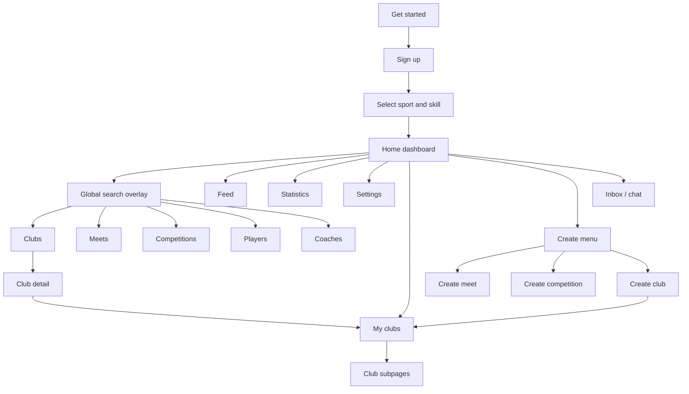

# ReClub App Flows

Source: screenshots in `../`. This is an inferred flow map based on visible UI only.

## Primary Navigation Model

ReClub appears to use:

- a tile-based home dashboard
- a global search/discovery overlay
- deeper nested club, event, competition, and profile screens

Unlike the other sets, the root structure does not appear to rely on a conventional bottom navigation bar.

## High-Level Flow Map



## Onboarding Flow

### Screens

- `ReClub Get Started.jpg`
- `ReClub Signup Front.jpg`
- `ReClub User Signup Input.jpg`
- `Select Your Sports with Selection Beginner, Medium, Expert.jpg`
- `Successful Signup.jpg`

### Flow

1. User opens the app and sees a welcome/setup screen.
2. User can start account creation or use a club code.
3. Signup collects account details.
4. User selects sport and self-identified skill level.
5. Successful signup leads into the main dashboard.

## Discovery Flow

### Screens

- `Homepage Search Icon - Clubs.jpg`
- `Homepage Search Icon - Meets.jpg`
- `Homepage Search Icon - Competitions.jpg`
- `Homepage Search Icon - Players.jpg`
- `Homepage Search Icon - Coaches.jpg`
- `Homepage Search Icon - Community Filter.jpg`
- `Homepage Search Icon - Your Sports Filter.jpg`
- `Homepage Search Icon - Map Filters.jpg`
- `Homepage Search Icon - Map Icon when click.jpg`

### Flow

```text
Home -> Search overlay
Search overlay -> pick content tab
Search overlay -> apply location/sport/community/map filters
Search overlay -> open result detail
```

## Clubs Flow

### Screens

- `Join a club.jpg`
- `Join a club - sample club details.jpg`
- `My Clubs Main Directory.jpg`
- `My Clubs - Sample Club Profile.jpg`
- `My Clubs - Activities.jpg`
- `My Clubs - Discussion.jpg`
- `My Clubs - Members.jpg`
- `My Clubs - Library.jpg`
- `My Clubs - Chat.jpg`
- `My Clubs - Menu Icon when Click.jpg`

### Flow

```text
Search clubs -> club detail -> join or inspect
Joined club -> My clubs
My clubs -> activities / discussion / members / library / chat
```

## Meets Flow

### Screens

- `Homepage Search Icon - Meets.jpg`
- `Homepage Search Icon - Meets - Details.jpg`
- `Homepage Search Icon - Meets - Details part 2.jpg`
- `Homepage Search Icon - Meets - Matches.jpg`
- `Create - Meet Option.jpg`
- `Create - Meet Input Details.jpg`

### Flow

```text
Search meets -> date/time grouped results -> meet detail -> matches or participation state
Create menu -> create meet -> choose mode or options -> enter details
```

## Competitions Flow

### Screens

- `Homepage Search Icon - Competitions.jpg`
- `Homepage Search Icon - Competitions - Details.jpg`
- `Homepage Search Icon - Competitions - Registration.jpg`
- `Homepage Search Icon - Competitions - Matches.jpg`
- `Homepage Search Icon - Competitions - Results.jpg`
- `Homepage Search Icon - Competitions - Discussion.jpg`
- `Create - Competition Info.jpg`
- `Create - Competition Input Details.jpg`

### Flow

```text
Search competitions -> detail -> registration / matches / results / discussion
Create menu -> create competition -> info -> detailed setup
```

## Creation Flow

### Screens

- `Create - meet, competition, club.jpg`
- `Create - Club Select Sports.jpg`
- `Create - Club Select Community.jpg`
- `Create - Club Name - Private.jpg`
- `Create - Club Invite Friends.jpg`
- `Create - Club Enable Chat.jpg`
- `Create - Club - Create 1st Activity.jpg`
- `Create - Club Success.jpg`
- `Create - Clubs Info.jpg`

### Flow

1. User opens the create menu.
2. User chooses `meet`, `competition`, or `club`.
3. Club creation proceeds through several onboarding-style steps.
4. Success likely routes the user into the newly created club.

## Stats And Profile Flow

### Screens

- `Statistics - Rankings.jpg`
- `Statistics - Cred Leaderboard.jpg`
- `Statistics - Teammates.jpg`
- `Statistics - Opponents.jpg`
- `Statistics - Charts.jpg`
- `Account Profile Settings.jpg`
- `Account Profile Game Profile.jpg`
- `Account Profile Language Settings.jpg`
- `Notifications Settings.jpg`

### Flow

```text
Home -> Statistics -> choose rankings / cred / teammates / opponents / charts
Home -> Settings -> account / language / notifications / other utilities
```
