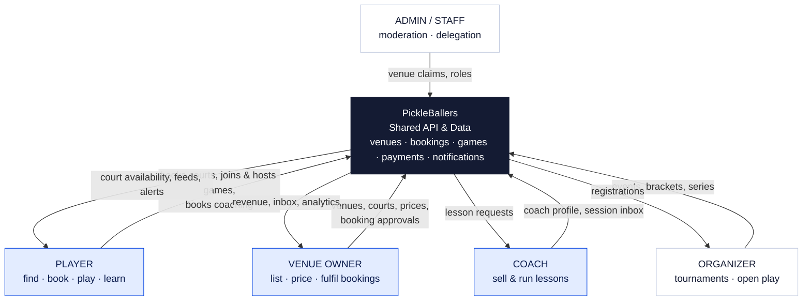
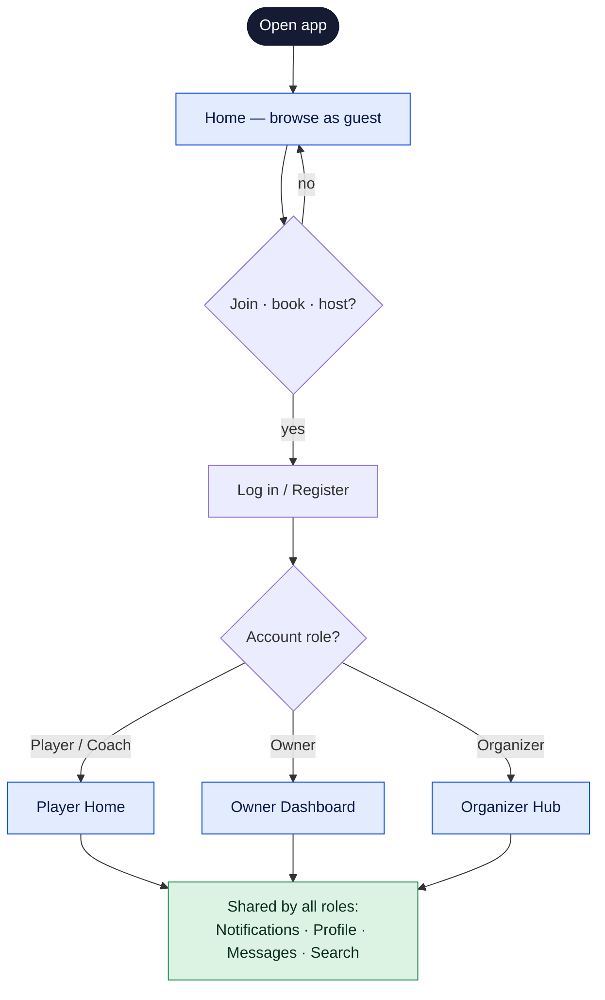
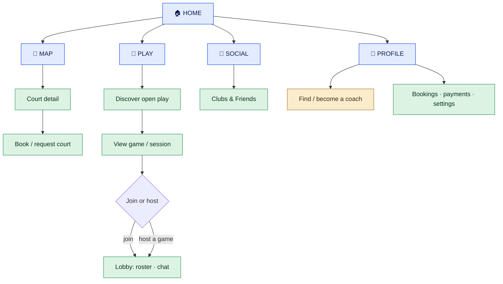
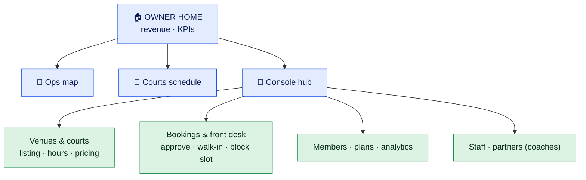
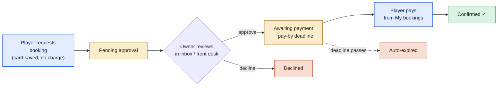
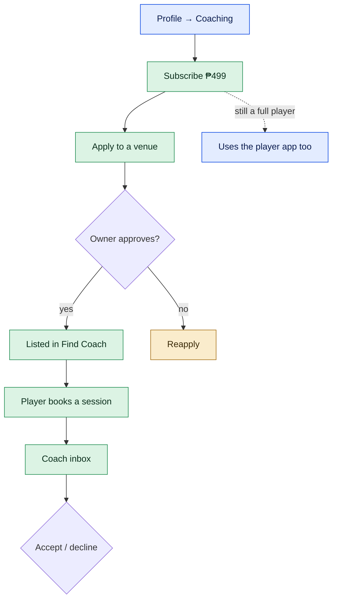
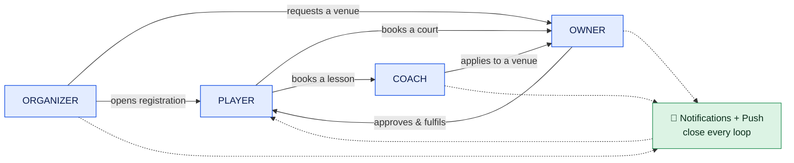

# PickleBallers — Product Map

> A plain-language, whiteboard-simple map of how the whole platform works, for
> players, venue owners, and coaches. Traced from the live code (PWA + web + API):
> routes, role permissions, navigation, and the journeys already wired to the API.
>
> Every diagram is kept simple enough to redraw on a whiteboard; the detail lives
> in the notes beside each one. A styled, shareable version is in
> [`pickleballers-product-map.html`](./pickleballers-product-map.html).
>
> _Statuses reflect the build as of mid-July 2026 and are conversation starters, not a QA report._

**Status legend**

| Status | Meaning |
|---|---|
| 🟢 **Implemented** | Live and wired to the API |
| 🟡 **Partially implemented** | Works, but a decided change or piece is outstanding |
| 🔵 **Planned** | Decided, not yet built |
| 🔴 **Needs confirmation** | Awaiting a product decision |

---

## 1. Platform Overview

PickleBallers is a two-sided marketplace for pickleball. One shared API feeds three
surfaces — a mobile PWA, a desktop website, and the backend — so the same booking,
game, and payment data drives every role.

- **Players** find courts, book them, join or host games, and buy coaching.
- **Venue owners** list facilities, manage courts and prices, and handle every booking.
- **Coaches** sell lessons.
- **Organizers** run tournaments and recurring open-play series; **Admins / Staff** keep the directory clean and delegate operations.

**Money model:** PickleBallers takes **7% on court bookings** and nothing else.
Coaching and organizer join-fees are unlocked by paid subscriptions (**₱499/coach**,
**₱999/organizer**), and the partner keeps 100%. 🔴 The live payment path is test-mode
only today; the real gateway (PayMongo), transaction fees, and automated refunds are
decided but not yet wired.

- **Guest-first** — the app opens on the Home tab as a guest; sign-in is prompted only when you commit to an action.
- **One account, many roles** — a single login can be a player and also a coach, organizer, or owner.
- **Role decides the home** — players & coaches get the player app, owners get an operations dashboard, organizers get a tools hub.

---

## 2. Shared Entry & Onboarding Flow

Everyone enters the same door. What differs is where "commit" takes you and which
home you land on once the account's role is known.

- 🟢 **Guest browsing is real** — cold start lands on Home; commit actions trigger the auth prompt.
- 🟢 **Login is live** — tokens stored, session restored on reload, profile edits + onboarding saved to the account.
- 🟢 **Onboarding is remembered** — returning users are never re-onboarded, across devices.
- 🔴 **Registration on the PWA is login-only** — the multi-role sign-up wizard (player / owner / coach) currently lives on the *web* site; the PWA assumes an existing account.

---

## 3. Player Flowchart

The player app is a five-tab shell — **Home · Map · Play · Social · Profile**. This is
also what coaches and organizers see, since they're players too.

### Three ways to play — and why they differ

- **Book** 🟢 — a private court reservation. No lobby, no strangers. Any player can do it.
- **Open Play** 🟡 — a public listing others can join. *Today* it's an interest board ("I'm interested" + who's in, no lobby). 🔵 The decided direction merges it into a full game with a real, player-capped lobby.
- **Game (hosted lobby)** 🟢 — a hosted game with a full lobby: named roster, invites, group chat, kick, and grace-period leave rules. You book & pay for the court up front, then host the lobby on it.

> ℹ️ **"Play" opens on Open Play; "Events" sits beside it.** Under each product tab a
> second row picks the *view* — Discover, Joined, or Manage. "Events" is a container for
> competitive formats (round-robin, mini-tournament, bracketing); only the public-game
> format is built so far, so it reads sparse by design. 🔵

> ℹ️ **The Tournament tab is currently switched off for everyone**
> (`canSeeTournaments = false`). Tournament browse, registration, participant chat, and
> bracket viewing are all built, but the standalone tab is hidden pending a decision on
> whether tournaments live inside Play or stay separate. The screens remain reachable by
> deep link and from the Discover feed. 🔴

---

## 4. Venue Owner Flowchart

Owners get a dedicated operations app — not the player design. The bottom nav becomes a
business console: a revenue dashboard, an operations map, a courts schedule, and a
Profile hub that opens every management tool.

### How a booking reaches the owner — request-to-book lifecycle

- **Owners never see the player design** — Home, Map, and Games tabs become owner dashboards; only Social and Profile fall through to shared screens.
- **Instant vs. approval booking is per-venue (and per-court)** — an owner can require approval before a court is held, with a configurable pay-window; otherwise bookings confirm on payment.
- **Manual / off-platform bookings** — phone, walk-in, or Messenger reservations are entered at the Front desk ("Add booking") or the dedicated Manual reservation screen, both double-booking-guarded. "Block slot" makes a time unavailable.
- **Staff are delegated, and scoped** — staff run the console for *all* the owner's venues but can't set prices, open the cross-venue revenue report, create/claim venues, or manage other staff.
- 🔴 **Owner payouts (Settlements)** — the screen exists, but real settlement is tied to the unwired payment gateway.

The full venue editor carries per-venue tabs: **Overview, Insights, Bookings inbox,
Membership, Listing** (+ booking policy: require-approval, pay-window, booking link),
**Location, Courts** (per-court details, hours, turnover, policy), **Closures, FAQs,
Reviews, Photos, Demand** (heatmaps, leakage, price suggestions).

---

## 5. Coach Flowchart

A coach is a player with a paid subscription and an extra inbox — there is no separate
coach app on mobile. The journey has two halves: **becoming** a coach, and **running**
sessions.

- 🟢 **The subscription is the gate, not the role** — becoming a coach requires an active paid plan; a lapsed subscription drops the coach from Find Coach even if the role lingers.
- 🟢 **The owner still approves each venue application** — the subscription buys "become a coach"; the venue owner grants the venue-scoped coach badge.
- 🟢 **Booking a coach is server-priced** — the price comes from the chosen service or the coach's hourly rate, never trusted from the client. A session is a claim on a person's time, tracked separately from court bookings.
- 🔵 **Lesson payment is not yet collected in-app** — today the flow assumes the player pays the coach directly. The decided model routes lesson fees through the app at 0% platform cut.
- 🔴 **A fuller coach dashboard exists on the web** — the desktop site has a coach console (overview, venues, applications); the mobile PWA gives the coach a booking inbox rather than a full dashboard.

---

## 6. Cross-Role Interaction Diagram

The roles are only useful because they connect. This is the connective tissue — who
hands work to whom, and how notifications close each loop.

- **Booking loop** — player books → owner approves & fulfils → player pays → confirmed.
- **Game loop** — a host books a court and opens a lobby → players join → roster fills → the host is notified "lobby full." Roster members share a group chat.
- **Coaching loop** — player books a session → coach accepts or declines in their inbox (they first subscribed and were approved by a venue owner).
- **Tournament loop** — organizer requests a venue → owner approves the slot → registration opens → players register → bracket runs to standings.

---

## 7. Navigation Summary

| Role | Landing page | Primary navigation | Major actions | Restrictions | Unclear / unfinished |
|---|---|---|---|---|---|
| **Player** | Home (guest until sign-in) | Home · Map · Play · Social · Profile | Book courts, join & host games, clubs & friends, book coaching, message, search | Commit actions require login; grace-period locks a full-lobby spot | Open Play lobby merge; Tournament tab hidden; in-app coach/organizer payments |
| **Venue Owner** | Owner Home (revenue dashboard) | Home · Map(ops) · Games(courts) · Social · Profile/Console | Manage venues/courts/hours/pricing, approve bookings, front desk & manual entry, analytics, staff, partners | No player home; can't self-onboard as player by default | Settlements/payouts pending gateway; some tools live-but-unapproved |
| **Coach** | Player Home (same as player) | Player tabs + Profile → Coaching + booking inbox | Subscribe, apply to venues, get listed, accept/decline sessions | Must hold an active subscription to be listed / bookable | Lesson fees not yet collected in-app; mobile has inbox, not full dashboard |
| **Organizer** | Organizer Hub (tools console) | Hub → Tournaments · Open Play · Rosters · Venue requests | Create tournaments, run brackets, recurring series, request venues | Owner still approves venue requests; own tab chrome, not player v2 | Join-fee collection; tournaments' place relative to Play |
| **Staff** | Owner console (delegated) | Owner console for all of the parent owner's venues | Work bookings, front desk, calendar, per-venue inbox | No pricing, no cross-venue reports, no new venues, no staff mgmt | Finer-grained staff permission levels are deferred |
| **Admin** | Home + admin surfaces | Admin claims (mobile) · full admin console (web) | Review venue claims, moderation, roles & permissions | — | Most admin depth lives on the web, not the PWA |

---

## 8. Findings & Clarifications

Presented collaboratively — these are areas that are evolving or awaiting a product
decision, not defects. Each is worth a quick confirmation before the next build phase.

- **Open Play is mid-transition** 🟡 — today an "I'm interested" board with no lobby; the decided direction merges it into a full game with a player-set cap (roster, invites, chat). Both models exist in the data right now.
- **"Events" reads empty by design** 🔴 — inside Play, "Events" is a container for competitive formats, but only the public-game format is built. Confirm whether to build the other formats, or surface standalone Tournaments here.
- **The Tournament tab is switched off** 🔴 — full tournament screens are built and reachable by link, but the bottom-nav tab is hidden for every role pending a decision on where tournaments belong. A deliberate hold, not missing work.
- **Payments are test-mode only** 🔵 — checkout completes without a real charge. Gateway (PayMongo), player-borne transaction fees, refund automation (3-day free-cancel window), organizer join-fee collection, and owner settlements are decided but unwired. Fee percentages should stay in settings, not hardcoded.
- **A game card can show a price you don't pay** 🔴 — a player-hosted game shows the venue's hourly court rate (which the host already paid); joining is free. The Discover *filter* handles this correctly, but the card copy can still mislead until Open Play charging rules are finalized.
- **Some surfaces differ between web and PWA** 🔴 — multi-role registration and the deepest coach / admin dashboards live on the desktop website; the PWA is login-first and gives coaches an inbox rather than a full console. Confirm which surface is canonical per role at launch.
- **Ineligible games are shown, not hidden** 🔵 — the decided rule is to show a game you can't join, mark it, and disable the card + Join button. Currently such games can still be opened. A small piece of enforcement remains.
- **Profile stats are still demo data** 🟡 — identity fields (name, avatar, skill tier, address) are real and saved; win-rate, streak, and achievements are placeholder until a player-stats backend exists.

> ⚑ **"Live-but-unapproved" watchlist.** A handful of things run in the app without a
> formal sign-off: the ₱499 coach subscription (the only feature currently earning), the
> ₱999 organizer subscription (zero subscribers), the pricing engine, rental inventory,
> request-to-book, and a partner-revenue figure. Each needs a simple keep-or-cut
> decision — none block the Open Play build.
