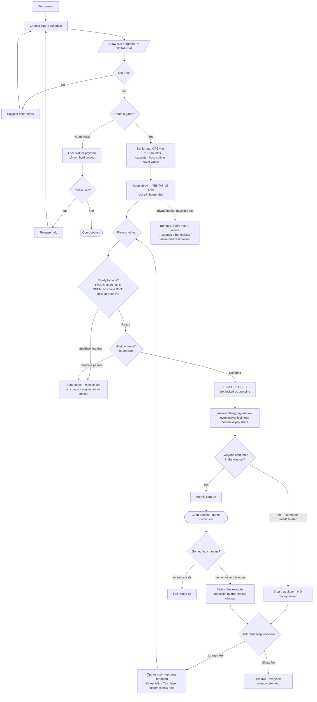

# Book-a-Court Flow (with open games + split payment)

Status: **design** — the open-game/split branch is not built yet. The simple
**private-reservation branch IS built** (see "What's built" below). Supersedes
the hand-drawn flow. Builds on the existing `api/` slices: `bookings/`,
`payments/` (`Payment` + `VenuePricing`), `games/`, and the `owner/` console.

## What's built (2026-06-04) — the simple booking branch

The private-reservation path is live in the PWA: **pick court → date/time →
see cost → pay (test-mode checkout) → confirmed**, plus a My-bookings list with
cancel. Decisions baked in:

- **Require a price** — only venues with a `priceFrom` rate are bookable.
- **Cost** = `priceFrom × hours`, shown before commitment.
- **Server-backed test mode** — a new `AppSettings` singleton (`GET /settings`
  public, `PATCH /settings` admin via `admin.settings.manage`) holds
  `paymentTestMode` (default **on**). `POST /api/v1/payments/checkout` reads it:
  in **test mode** it creates a completed `Payment` and flips the booking to
  `confirmed` (no charge); in **live mode** it records a pending payment and the
  booking stays `pending_approval` (future real-gateway seam).
- Gated by the new `player.bookings.create` permission.

Still TODO (follow-up, see bottom): point the **web** admin toggle
(`AdminSettingsPage.jsx`, currently localStorage-only) and web `CheckoutPage.jsx`
at the new endpoints so the website honours the same server flag.

## Payments & settlement (escrow model)

Money flows **to the platform first**, not straight to the venue. The platform
holds funds and settles to each venue **after the session** (or on a periodic —
e.g. monthly — payout / revenue cycle). This is what lets refunds, the
all-or-nothing split, and cancellations work without clawing back money already
in a venue's account. Net of any cancellation deductions, the venue is paid out
on the settlement cycle. (Gateway choice is still TBD; test mode charges no one.)

## Money-state ladder (the spine of the whole thing)

Money only exists in the last state. Every transition has a **deadline** and a
**"falls through → reopen or dissolve"** escape.

```
tentative hold  →  divisor locked  →  paid / booked
(open lobby,        (confirm + pay     (refund rules +
 bump-able)          window, slot       free-cancel
                     locked)            window apply)
```

## Full flow



## Rules that make the branches unambiguous

| Decision | Rule |
|---|---|
| **Total cost shown** | At *Choose court/schedule* — `rate × duration`. Host can bail to another court here. |
| **Split** | Always `total ÷ players-in-lobby`. Host may instead choose **cover-whole**. |
| **Min players** | OPEN: still needs **≥2** (can't play alone). FIXED (doubles): exactly 4 or it cancels. |
| **Price lock** | Locks at **host-confirm**. Backfillers pay open shares; people who stayed are never re-charged. |
| **No money until confirm** | Nothing is captured before host-confirm + everyone's pay-confirm (all-or-nothing). |
| **Bump priority** | A **paid** booking beats a **tentative** open lobby. Once a slot is locked (private payment OR open pay-window), it can't be bumped. |
| **Free-cancel window** | Free cancel > X hrs before play; **deduction** after (court's about to go to waste). |
| **Reopen on backout** | Survives if **≥1** remaining player opts in; dissolves only if **all** opt out. |
| **Host transfer** | If the host backs out and the lobby reopens, an opt-in player becomes the **new host**. |

## Permission

New capability ⇒ new permission per repo convention:
`player.bookings.create` — gate the screen + the `POST /bookings` route, add to
the three synced `permissions` copies + `PERMISSION_CATALOGUE` + role defaults.
```
