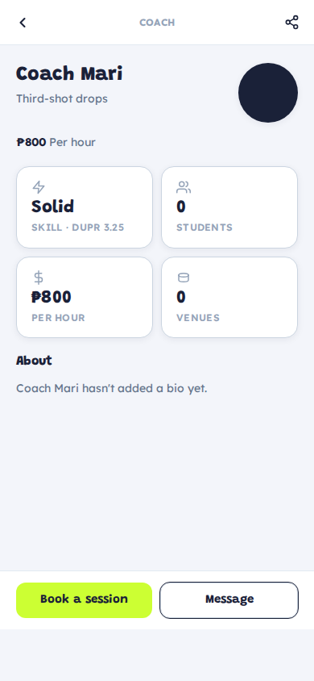
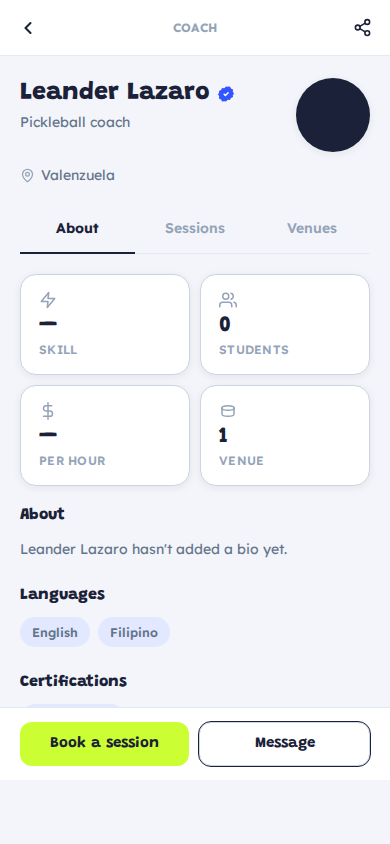
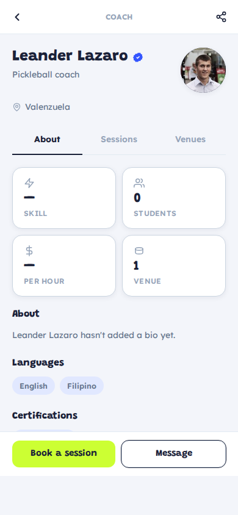
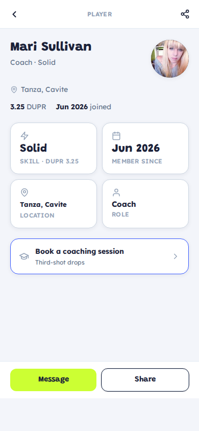
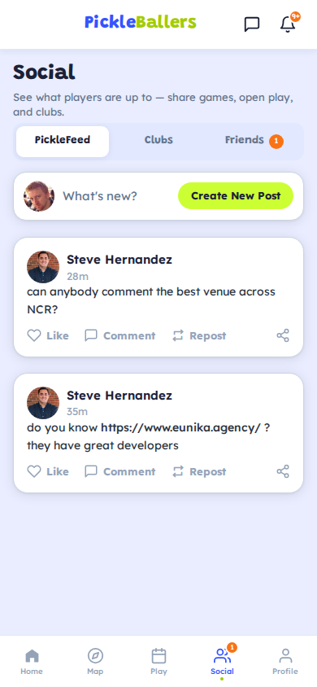

# Public Profile Redesign (Coach & Player)

**Date:** 2026-07-15

## What changed

Coach detail (`/coaches/:slug`) and player profile (`/players/:id`) now share one Threads-style layout via a new `shared/components/ui/PublicProfileHero` component.

### Layout

- Sticky top bar: back arrow (left) + section label + share button (right)
- **Header**: bold name + verified check on the left, round avatar top-right
- Handle line under name (e.g. "Third-shot drops" or "Coach · Solid")
- Bio paragraph
- **2×2 stat card grid**: Skill level, Students, Rate per hour, Venues
- **Tab strip** (coaches only): About · Sessions · Venues — only tabs with content render
- **Sticky bottom bar**: two action buttons pinned at the bottom (Book + Message / Message + Share)

### Screenshots

| Screen | Image |
|---|---|
| Coach Mari |  |
| Coach Leander (with tabs) |  |
| Coach Leander — Sessions tab |  |
| Player (Mari Sullivan) |  |
| Friends → tap row → player profile |  |

### API changes (`api/src/features/coaches/coaches.controller.ts`)

- `coachPayload` and `listCoaches` now fall back to the linked user's `avatarUrl` when the coach has no profile photo
- Also surfaces `skillLevel` / `skillLevelLabel` from the user account
- Adds `studentCount` (unique players with completed sessions) and `completedSessionCount` from `CoachBooking`

### Friends list

In `FriendsPanel`, tapping a friend/request/suggestion row now navigates to that player's profile. The right-side action buttons (Message, Confirm, Add friend, etc.) still work independently.

### Files changed

| File | Change |
|---|---|
| `app/src/shared/components/ui/PublicProfileHero.tsx` | **New** — reusable Threads-style profile header |
| `app/src/shared/styles/v2.css` | Added `.px-*` rules (~200 lines): topbar, hero, avatar, grid cards, tabs, body, sticky CTA |
| `app/src/features/coaches/CoachDetailScreen.tsx` | Rewrote render with new layout, 2×2 grid, info chips, sticky bottom bar |
| `app/src/features/profile/PlayerProfileScreen.tsx` | Rewrote render with same layout + grid, sticky bottom bar |
| `app/src/features/social/FriendsPanel.tsx` | Rows now tappable → opens `player-profile` |
| `app/src/shared/lib/api.ts` | Added `skillLevel`, `skillLevelLabel`, `studentCount`, `completedSessionCount` to `ApiCoach` |
| `api/src/features/coaches/coaches.controller.ts` | User avatar fallback, skill level, student/session counts in `coachPayload` and `listCoaches` |
